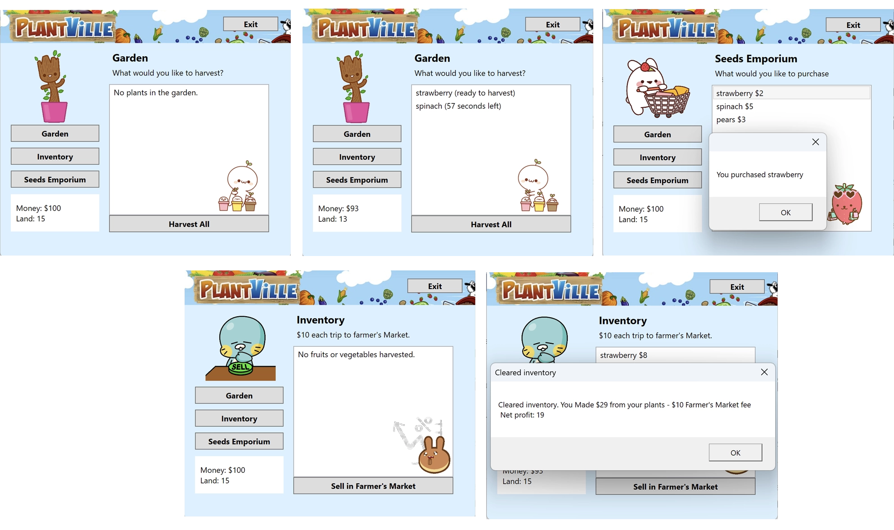

# PlantVille Game
A C# App inspired by the FarmVille game.

## Copyright Disclaimer / Student Warning
_This project was developed for the C# II course part of the UCLA Applications Certificate._

_If you're a student currently enrolled to this course feel free to review my code **but only for study purposes.**_

***DO NOT hand it in as yours***, _professor has all the records of each one of our previous delivered works, so he will know it and you'll undoubtedly get in trouble for plagiarism._

## Description ##
We'll play as a farmer who buys seeds, waits for them to harvest, then reap the rewards! 

## Screenshots

## Features
1. Players start with $100
2. Players start with 15 land plots. This means they can grow 15 plants at one time.
3. Each menu button displays a different body: Seed emporium, garden, and inventory
4. Status bar (money and land plots) should be updated on any change.
5. Seed emporium
    - Displays the list of seeds available for sale. This data should be stored in one place only, the seed_list (look below at Code requirements #3). This means we should be able to fully control the seeds available from that list.
    - Players can only buy seeds if they have enough money and available land plots.
    - When you purchase a seed, it automatically gets planted into your garden
6. Garden
    - Print message "No plants in garden" if empty.
    - Display the plants and how long they have until they can be harvested.
    - If a plant isn't harvested 15 min after it's ready, then it spoils on the vine.
    - When you harvest a plant, it goes into your inventory.
    - Double click each plant to harvest individually. Harvest all button pulls all plants that are ready.
7. Inventory
    - Build up fruits and vegetables in your inventory.
    - You can sell your inventory by going to the farmer's market, but it costs $10 to set up a booth, regardless of how many items you sell.
    - Warn player if they try to go to the farmer's market without any product to sell.
    - Print empty message if empty.
8. Saving state
    - If there's no data file, then load player with default stats.
    - If there's a data file, then load stats from file. Load these stats:
      - Amount of money they have
      - What is in their inventory.
      - What is in their garden.
    - Player's current state saves to a file when the game closes.
9. Seeds - These plants are available at the Emporium:
    - Strawberries
      - Seed price $2
      - Harvest price $8
      - 30 seconds to harvest
    - Spinach
      - Seed price $5
      - Harvest price $21
      - 1 min to harvest
    - Pears
      - Seed price $2
      - Harvest price $20
      - 3 minutes to harvest
